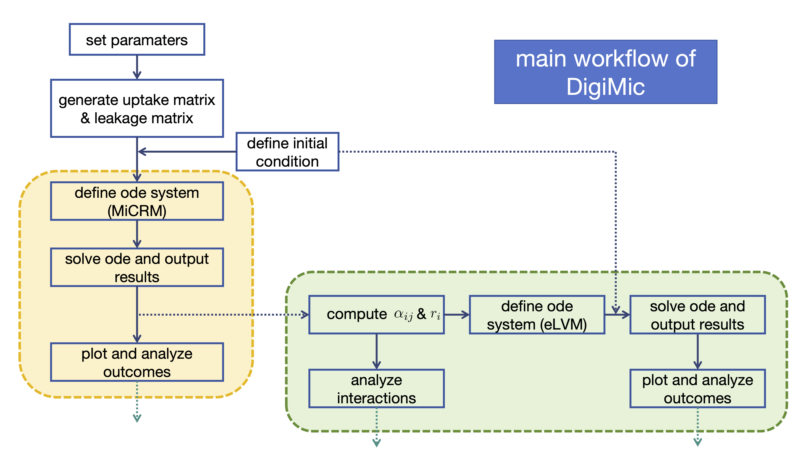

# Technical details



## Simulation workflow

A package simulation has four steps:

1. Generate or supply ecological parameter arrays.
2. Construct a validated `MiCRMParameters` object.
3. Combine consumer and resource initial conditions into one state vector.
4. Call `solve_micrm` and check the returned solver status.

## State vector layout

The first `N` entries are consumers and the final `M` entries are resources:

```python
consumers = state[:parameters.n_consumers]
resources = state[parameters.n_consumers:]
```

`micrm_rhs` returns derivatives in the same order.

## Parameter shapes and validation

| Field | Shape | Validation |
|---|---:|---|
| `uptake` | `(N, M)` | finite and nonnegative |
| `mortality` | `(N,)` | finite and nonnegative |
| `resource_supply` | `(M,)` | finite and nonnegative |
| `resource_decay` | `(M,)` | finite and nonnegative |
| `leakage` | `(N, M, M)` | finite, nonnegative, and row-normalised |
| `leakage_fraction` | stored as `(N, M)` | between zero and one; `(M,)` inputs are broadcast |
| `consumer_ids` | optional `(N,)` | unique, hashable labels |
| `resource_ids` | optional `(M,)` | unique, hashable labels |

A resource-vector leakage fraction is broadcast across consumers. Numeric
inputs are copied into floating-point arrays and exposed read-only so later
mutation of an input array cannot silently change a model.

Spatial transport requires explicit identifiers for every transported consumer
or resource. Their values and order must match across patches so each flux is
applied to the same state variable.

## Reproducible parameter generation

Create and retain an explicit NumPy generator:

```python
rng = np.random.default_rng(42)
uptake = modular_uptake(
    n_consumers=10,
    n_resources=5,
    n_modules=2,
    specialization_ratio=10.0,
    rng=rng,
)
```

Passing the same seed to a new generator reproduces the same result. The
package does not read or advance NumPy's legacy global random state.

## Numerical integration

`solve_micrm` validates the initial state and delegates integration to
`scipy.integrate.solve_ivp`. Standard solver options such as `method`, `rtol`,
`atol`, `events`, and `jac` can be passed by keyword. `args` is managed by the
wrapper and `vectorized=True` is intentionally unsupported.

Always inspect:

- `result.success` and `result.message`;
- the final derivative norm before treating an endpoint as equilibrium;
- minimum consumer and resource values for numerical undershoot; and
- sensitivity to tolerances for stiff or near-extinction trajectories.
